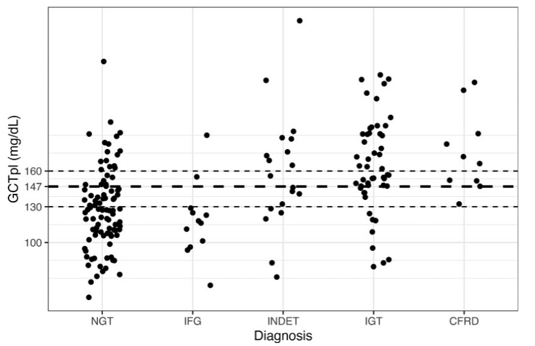

## Background

- With increased survival, we are seeing increased prevalence of CF-related complications.
- CF-related diabetes (CFRD) is a comorbidity that ultimately affects nearly half of the CF population.
  - Associated with worse pulmonary function, malnutrition, and a three- to fivefold increased risk of mortality.
- Timely diagnosis and treatment with insulin has been shown to reverse declines in clinical trajectories.

## Current guidelines

- Recommend an annual oral glucose tolerance test (OGTT) starting at 10 years of age.
- OGTTs are inconvenient and unpleasant.
  - Require fasting and multiple blood draws.
  - Sugary drink often makes patients nauseous. 
- Annual screening rates are consistently suboptimal.
  - Around 30–60%
  - Less than 30% in adults over 30 years of age

## Our study

- Aimed to investigate the potential utility of a glucose challenge test (GCT) as first-line screening for CFRD.
  - Non-fasting with 50g of glucose
  - Measurement of plasma and/or capillary glucose 1-h postchallenge (GCTpl and GCTcap)
  - Similar to screening for gestational diabetes mellitus (GDM)
- Followed by a confirmatory OGTT if GCT values exceed a prespecified cutoff.

## Objectives

1. Define a cutoff that detects CFRD and CF-related prediabetes with high sensitivity and reasonable specificity.
2. Compare the test performance of GCT to other convenient tests:
    - Hemoglobin A1c (HbA1c)
    - Random plasma glucose (RPG)
    - Random capillary glucose (RCG)

## Study procedures

- GCT was performed during the clinic visit without regard to fasting or timing of the last meal. 
- Blood samples were  obtained for RPG and RCG at the start of the challenge. 
- Participants then consumed an oral glucose drink (1.17 g glucose/kg, up to a maximum of 50 g). 
- After 60 min, plasma glucose (GCTpl) and capillary glucose (GCTcap) measurements were collected.
- Participants were then asked to return for an OGTT within 2 weeks.

## Study population

- Inclusion criteria: 
  - Age $\geq$ 10 years
  - No change in medication regimen over the preceding 3 weeks
  - Lung function testing within 10% of the highest FEV1pp within the prior 12 months. 

## Study population
- Exclusion criteria:
  - A prior diagnosis of diabetes, 
  - Use of systemic glucocorticoids within the prior 6 weeks, 
  - A pulmonary exacerbation requiring intravenous antibiotics within the prior 3 weeks
  - Pregnancy

## Participant characteristics

{fig-align="center" width="95%"}

## Definitions

- Normal glucose tolerance (NGT): 
  - fasting plasma glucose (FPG) <100 mg/dL
  - 1-h plasma glucose (OGTT1hPG) <200 mg/dL
  - 2-h plasma glucose (OGTT-2hPG) <140 mg/dL
- Impaired glucose tolerance (IGT): was defined as 
  - FPG <126 mg/dL
  - OGTT-2hPG 140–199 mg/dL
- CFRD:
  - FPG $\geq$ 126 mg/dL and/or OGTT-2hPG $\geq$ 200 mg/dL.

## Statistical analysis

- Receiver operating characteristic curves (ROC) curves were generated.
  - Areas under the ROC curves (ROC-AUC) were used to determine the cut points that maximize Youden index (maximum sensitivity + specificity − 1) for identifying AGT and CFRD. 
  - Bootstrap CIs were calculated with 2,000 replicates.
- We additionally examined a range of glycemic thresholds and their associated test performance characteristics.

## Distribution of alternative markers

{fig-align="center" width="95%"}

## Distribution of GCTpl

{fig-align="center" width="95%"}

## Conclusions

- A GCTpl threshold of 147 mg/dL had high sensitivity (90%) for detecting CFRD.
  - 76% of those with IGT
  - 53% of those with INDET
  - Could spare 56% of the population from needing a follow-up OGTT.
- GCTpl outperformed RPG, RCG, and HbA1c.

## Conclusions

- A higher GCTpl threshold of 160 mg/dL would capture 6 of 10 participants with CFRD but rule out more patients with NGT (84%). 
- A more sensitive lower GCTpl threshold of 130 mg/dL would capture all participants with CFRD.
  - 84% of those with IGT and
  - 63% of those with INDET

## Limitations{.smaller}

- Relatively small number of individuals diagnosed with CFRD
- Unable to assess the impact of GCTpl screening on clinical outcomes.
- Most study visits occurred prior to widespread availability of triple-combination CFTR modulators.
  - Such therapy would not be expected to alter the GCTpl-OGTT glucose relationship.
- Cross sectional data don't allow for analysis of sequential GCT results.
- Testing was not evaluated as a sequence, and didn't account for correlated errors between tests.

# Math time!

## Two-stage screening

- The performance of the full diagnostic sequence is dictated by:
  - The diagnostic performance of each test in the sequence
  - The conditional dependence between them, given true disease status

## Two-stage screening

- The "OR" rule ("believe the positive")

```{r}
library(kableExtra)
m <- matrix(c("+", "+", "+", "-"), nrow = 2, ncol = 2)
colnames(m) <- c("Test 1 +", "Test 1 -")
rownames(m) <- c("Test 2 +", "Test 2 -")
kable(m)
```

- The "AND" rule ("believe the negative")

```{r}
m <- matrix(c("+", "-", "-", "-"), nrow = 2, ncol = 2)
colnames(m) <- c("Test 1 +", "Test 1 -")
rownames(m) <- c("Test 2 +", "Test 2 -")
kable(m)
```

## Notation

- $X_1 \wedge X_2$ indicates that $X_1 = 1 \text{ AND }  X_2 = 1$
- $X_1 \vee X_2$ indicates that $X_1 = 1 \text{ OR }  X_2 = 1$
- $\rho_{+}=Corr(X_1,X_2|D=1)$
- $\rho_{-}=Corr(X_1,X_2|D=0)$

::: {.notes}
Correlations are between two index test results given positive and negative disease status.
:::

## Sensitivity of the AND rule

\begin{aligned}
Se(X_1 \wedge X_2) &= P((X_1 = 1, X_2 = 1) \mid D = 1) \\
                 &= P(X_2 = 1 \mid X_1 = 1, D = 1)Se(X_1) \\
                 &=Se(X_1)Se(X_2) + \tau_{+}
\end{aligned}

where 
$$
\tau_{+} = \rho_{+}[Se(X_1)Se(X_2)(1 − Se(X_1))(1 − Se(X_2))]^{0.5}
$$

## Specificity of the AND rule

\begin{aligned}
Sp(X_1 \wedge X_2) &= 1 - P((X_1 = 1, X_2 = 1) \mid D = 0) \\
                 &= 1 - P(X_2 = 1 \mid X_1 = 1, D = 0)(1 - Sp(X_1)) \\
                 &=1 - (1 - Sp(X_1))(1 - Sp(X_2)) - \tau_{-}
\end{aligned}

where 
$$
\tau_{-} = \rho_{-}[Sp(X_1)Sp(X_2)(1 - Sp(X_1))(1 - Sp(X_2))]^{0.5}
$$

## Sensitivity and specificity bounds

$$
Se(X_1 ∨ X_2) \geq max\{Se(X_1), Se(X_2)\} \\
Sp(X_1 ∨ X_2) \leq min\{Sp(X_1), Sp(X_2)\} \\
Se(X_1 ∧ X_2) \leq min\{Se(X_1), Se(X_2)\} \\
Sp(X_1 ∧ X_2) \geq max\{Sp(X_1), Sp(X_2)\}
$$

## All this to say...

- Sensitivity and specificity can be expressed in terms of conditional correlations given positive or negative true disease status ($\rho_{+}$ and $\rho_{-}$).
- Combined *sensitivity* increases when the two tests are **positively** correlated given disease positive.
- Combined *specificity* increases when the two tests are **negatively** correlated given disease negative.
- The sensitivity of the combined test is less than or equal to that of either test administered on its own. 
- The specificity is greater than or equal to an individual test.

## Conditional testing

<style>
.grViz, .html-widget, div[id^="htmlwidget-"] { overflow: hidden !important; }
</style>

- Things become even more complicated when the decision to perform one test depends on the results of the first test. 

```{r}
library(DiagrammeR)
# Node data frame
nodes <- create_node_df(
  n = 6,
  label = c("Test 1 +", "Test 1 -", "Test 2 +", "Test 2 -", "+", "-"),
  shape = c(
    "rectangle",
    "rectangle",
    "rectangle",
    "rectangle",
    "circle",
    "circle"
  ),
  x = c(0, 0, 2, 2, 4, 4),
  y = c(2, 0, 3, 1, 3, 0),
  width = 1,
  height = 0.8,
  fontsize = 18,
  fixedsize = TRUE,
  fillcolor = "white",
  color = "black",
  fontcolor = "black"
)

# Edge data frame
edges <- create_edge_df(
  from = c(1, 1, 3, 4, 2),
  to = c(3, 4, 5, 6, 6),
  color = "black"
)
# Put it together
graph <- create_graph(nodes_df = nodes, edges_df = edges) |>
  add_global_graph_attrs("layout", "neato", "graph") |> # honor x/y coords
  add_global_graph_attrs("rankdir", "LR", "graph")
render_graph(graph)
```

## Conditional testing

- One approach is to model the test sequence as a multinomial distribution with prevalence $\pi$

\begin{aligned}
L = \prod_{i,j=0}^l \Big[
  &\pi P(X_1 = i, X_2 = j \mid D = 1) \\
  &+ (1 - \pi) P(X_1 = i, X_2 = j \mid D = 0)
\Big]^{x_{i,j}}
\end{aligned}

where the $x_{ij}$ are the number of individuals for each possible combination of index test results

## Yet another complication

- Misclassification of reference standard tests.
  - Estimates of diagnostic accuracy are biased when there is incomplete disease status knowledge.
    - We have known for a while that the OGTT is likely not the best way to identify CFRD.
    - If some patients do not undergo the reference standard, estimation of sensitivity, specificity, and prevalence are imperfect.

## Analyzing test sequences with an imperfect standard{.smaller}

- One approach is to model the conditional dependence between tests using the covariance between tests, treating disease status as a latent variable.
  - Unfortunately, the fully-parameterised model is unidentifiable.
    - Either fix some parameters deterministically or use Bayesian methods with informative priors
- Can also model conditional dependence between test results in terms of individual-level random effects.
  - A latent measure of disease "intensity"
- Continuous tests can also be modelled as arising from a mixture distribution.

## Future directions

- Latent-class re-analysis allowing OGTT imperfection and GCT–OGTT error correlation
  - Adjusted for age and other covariates (limited by sample size)
- Prospective cohort study with continuous glucose monitoring (CGM) for CFRD verification.
  - Perhaps a randomized trial of screening strategies powered on CFRD events

## References
